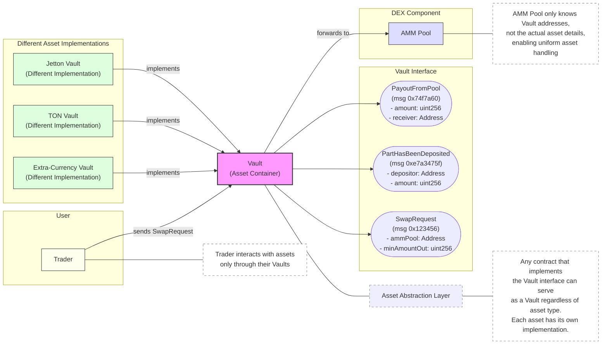
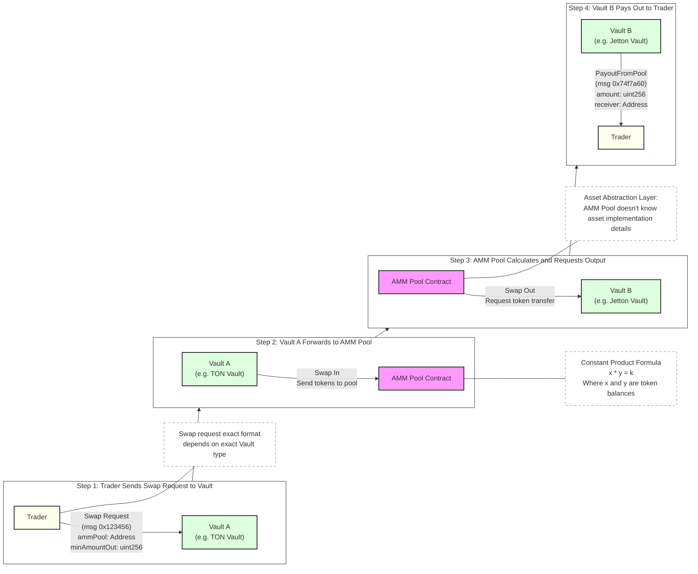
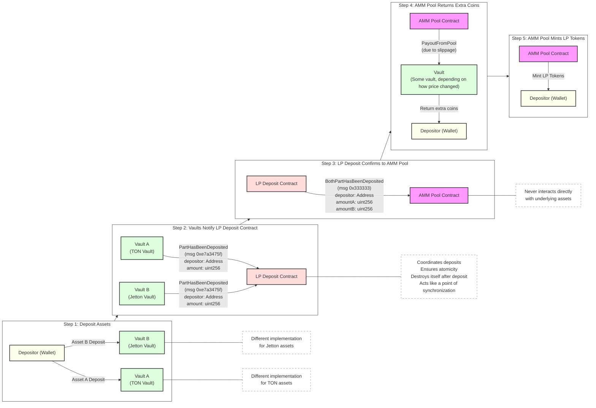

# OpenDeFi Library: Decentralized Exchange in Tact, T-Dex

<div align="center">


**T-Dex**: A decentralized exchange (DEX) on the TON blockchain providing<br>efficient exchange of various token types with a high degree of asset abstraction.

</div>

Check out T-Dex wip dApp frontend to perform swaps with web UI:

Link: https://tact-lang.github.io/dex-frontend/
Repo: https://github.com/tact-lang/dex-frontend

You can use this example to see how to integrate with T-Dex contracts from the frontend or execute swap transactions.

## Project Goals

- Creating a state-of-the-art fully open-source decentralized exchange (DEX)
- Minimizing commission costs through optimized architecture
- Providing a real-world example of a complex system of smart contracts, written in Tact
- Providing an example of safe and complex Jettons interaction

## Project Scope

- Smart contracts for Vaults of various asset types
- Automated Market Maker (AMM) Pool contracts
- Contracts for secure liquidity addition

## How-to and dev docs

Check these docs to learn about how T-Dex works, its semantics and how to integrate with it.

- [How to swap on T-Dex](./dev-docs/swap.md)
- [How to manage liquidity](./dev-docs/liquidity.md)
- How to work with Factory, TODO
- How to create new pool and vaults, TODO

## Examples and usage

### Contracts

T-Dex contracts are deployed in testnet and are ready for usage and testing purposes.

- [Jetton A](https://testnet.tonviewer.com/kQBCzXhQNxS727KxwsHld8aVNoFpSka0Xzr3GUBOxC_l2gQM)
- [Jetton A Vault](https://testnet.tonviewer.com/kQBBWii_pqdQWcWQ9pWPC7lt1qoNngdZ9TuUMgT81TFgQiM_)

- [Jetton B](https://testnet.tonviewer.com/kQDO8Rt30nYL8RbXOWWMCqY3E4o-mN-tum0MTlABiFTDtz2p)
- [Jetton B Vault](https://testnet.tonviewer.com/kQBtrwWIuAD_KJIoI14S3jxcANwnL4TrTvsj88cGXVCfG6y2)

- [A-B Jettons pool](https://testnet.tonviewer.com/kQDRJqnVNdRdCH8u9cVclk-iZKpI4bVMBvgyTWfNyI6rTtQH)
- [Proxy liquidity deposit](https://testnet.tonviewer.com/0QBa3_cmTS4lg_pGBt_k5t1NEfHFnsDm8Y2UkD_t3MCQHAG7) (Non-existent because was destroyed after tx)

- [T-Dex factory](https://testnet.tonviewer.com/kQDR9j1SuiGtbSi7NZNgNwlDPIWZFEN5BLMz6AOd-IpGunLG) (No tx on it, used for get-methods)
- [Ton Vault](https://testnet.tonviewer.com/kQDTsG5OoAbrtTRpYMHlmqDXwI9mj3Iv-wj-NNrNf0BDG1dJ) (Inited, but no pools with it yet)

### Transactions

- [A-B Jettons liquidity provisioning](https://testnet.tonviewer.com/transaction/21825ccd231a2aae8dbb95307f9a3b46cff61f2f863a4b9a1a35ec6c6e18f4f3) (Lp jettons minting in the end)
- [A->B Jettons exact-out swap with slippage](https://testnet.tonviewer.com/transaction/91c4004bda0941ee16a611689bacdd4105b6ef230d3b6b9419ec20d40b784cfa) (Notice partial A jetton refund because of slippage)
- [A->B Jettons exact-in swap](https://testnet.tonviewer.com/transaction/8645178e74ab066e86d5bf1912bf05298c1ecf68887a8d38463a8a9aa2c57fda)
- [B->A Jettons swap with low decimals](https://testnet.tonviewer.com/transaction/fdabd6abb38adf2a705417a809f86b8421638479439466a99bb977ebca496cd9)
- [B Vault initialization](https://testnet.tonviewer.com/transaction/c6f4a9758ab80fd2172af8f82e40d55a98cec4e79df32734761a03a90450cb81)

## DEX Architecture

DEX is built on a modular architecture with clear component separation:

### Core System Components



### Swap Process



### Liquidity Provision Process



## Key Features

- **Tact based**: Easy to read and understand code, with a focus on safety and security
- **Asset Abstraction**: Vault is a contract, that stores any kind of an Asset (TON, Jetton, Extra Currency, etc.). All other contracts stores Vaults addresses.
- **Cheap Cross-pool swaps**: This architecture allows to easily perform cross-pool swaps with very low network fees.
- **AMM (Automated Market Maker)**: Using constant product formula for exchange rate determination
- **Atomic Liquidity Addition**: Synchronized asset addition through the LP Deposit contract
- **Exchange Fee**: 0.3% fee on token exchanges (configurable)
- **Constrained Swap Requests**: Ability to specify minimum output token amount and timeout

## Project Setup and Development

To start working with T-Dex, install all dependencies:

```shell
yarn install
```

Build the contracts:

```shell
yarn build
```

Other useful commands:

Run tests:

```shell
yarn test
```

Lint the code:

```shell
yarn lint
```

Format the code:

```shell
yarn fmt
```

## Testing

The project uses Jest for testing. Tests are located in the `sources/tests` directory and cover various aspects of the T-Dex functionality:

- `amm-pool.spec.ts` - Tests for the AMM Pool functionality
- `liquidity-deposit.spec.ts` - Tests for liquidity deposit process
- `liquidity-payloads.spec.ts` - Tests for payload handling in liquidity operations
- `swap-payloads.spec.ts` - Tests for payload handling in swap operations

To run all tests:

```shell
yarn test
```

## Contract Configuration

TODO: describe Tolk pipeline

## License

[MIT](./LICENSE)
